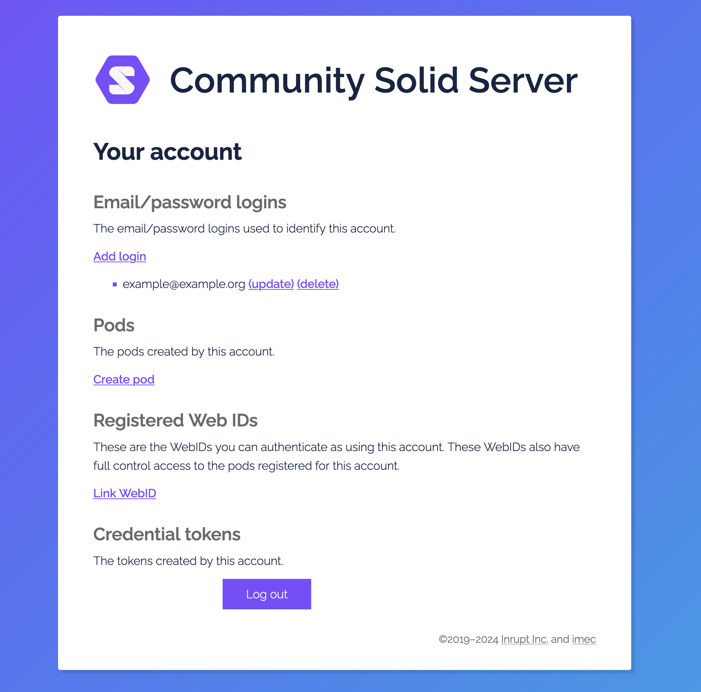
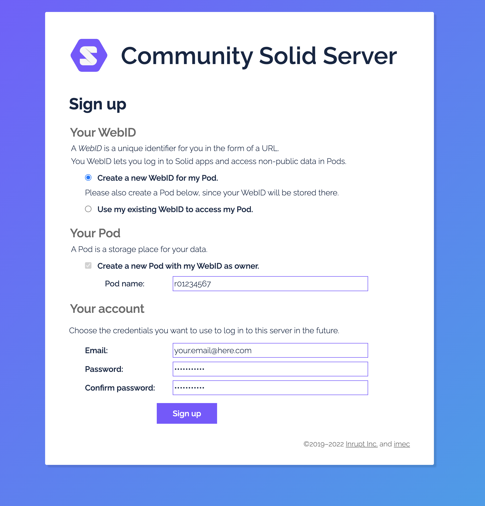
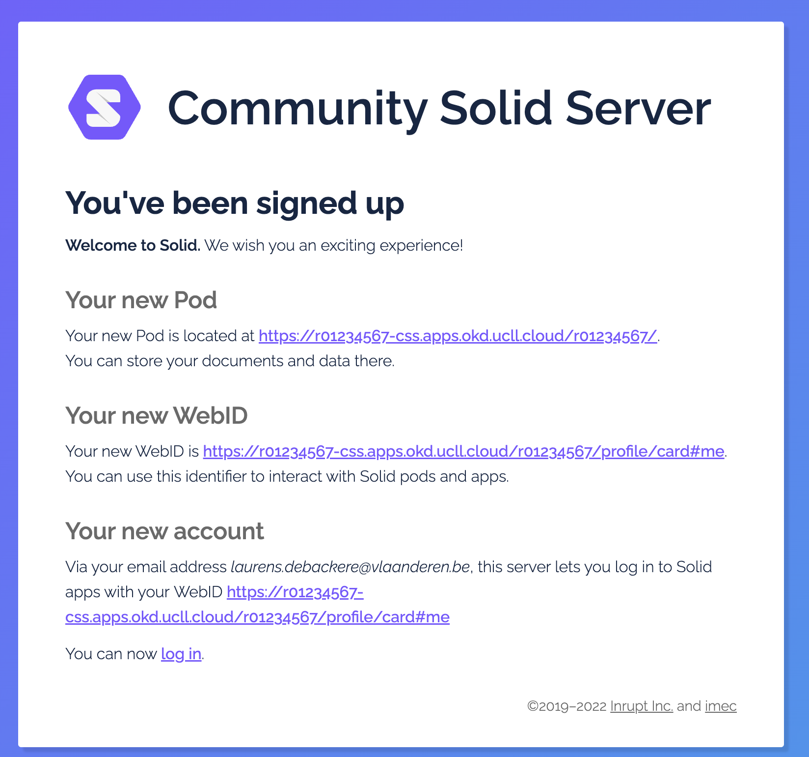
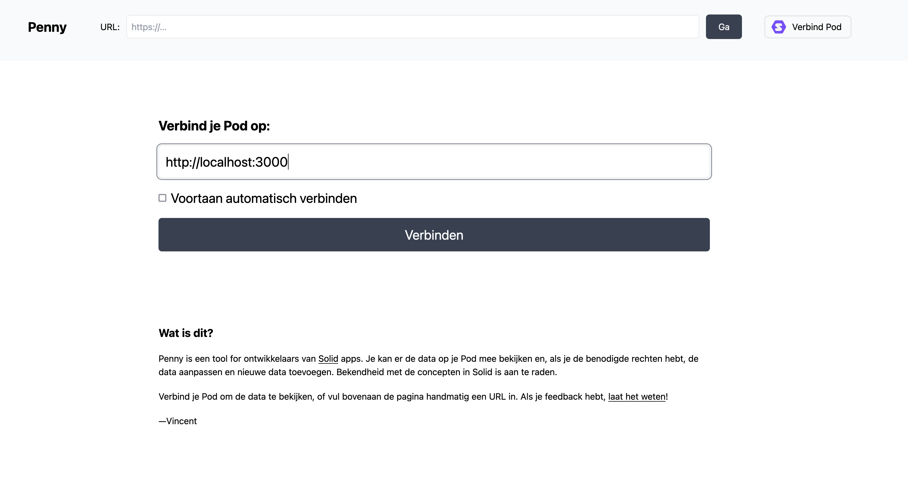
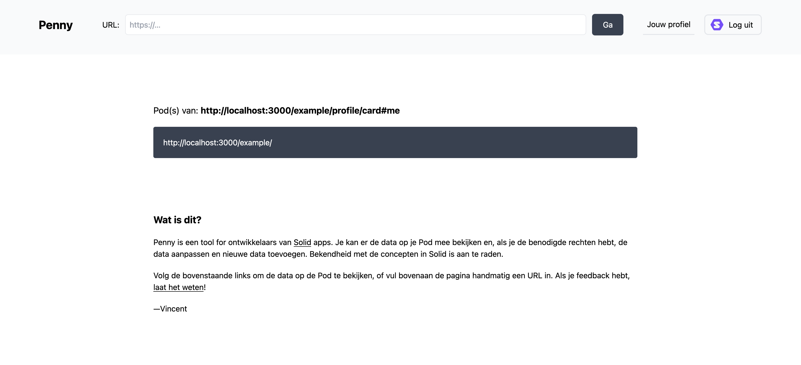
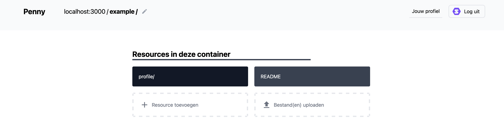
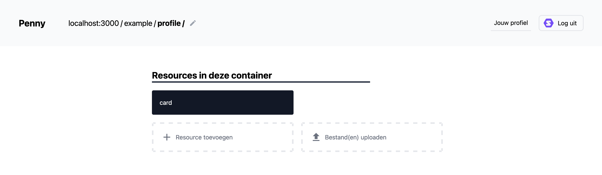
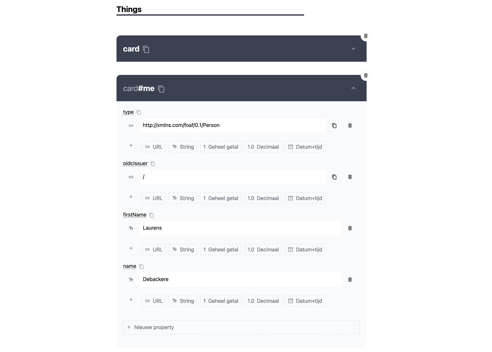
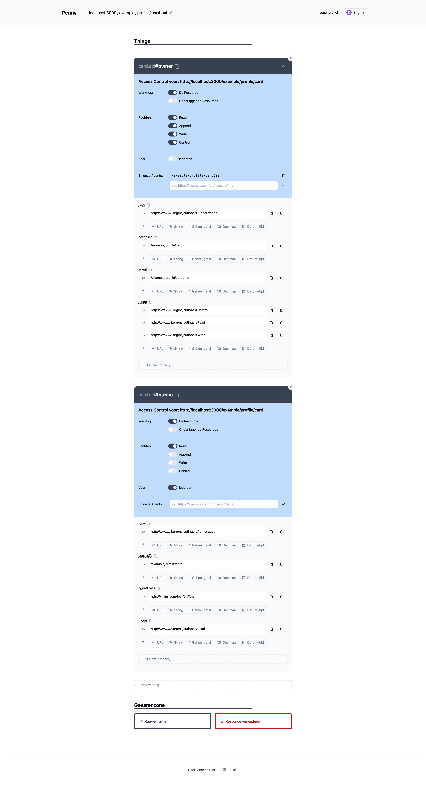

### Innovation for Good
# How do we fix the Web?
Now that we've learned about the origins of the Web, the boom of APIs in the 2010s and the potential of Linked Data and Solid, it's time for some hands-on experience.

## Pre-requisites
Install [Visual Studio Code](https://code.visualstudio.com/) on your machine.

Ensure you have a [Docker](https://docs.docker.com/desktop/) or [Podman](https://podman.io/) installation.

Clone this repository and open it in Visual Studio Code.

The exercises use VSCode devcontainers to provide a uniform environment for trying 

## 1. Exploring the Semantic Web
[RDF](https://www.w3.org/RDF/) is the foundational information model of the Semantic Web. Several different serializations of RDF exist, the most popular of which are [JSON-LD](https://json-ld.org/), [Turtle](https://www.w3.org/TR/turtle/) and [N-Quads](https://www.w3.org/TR/n-quads/).

### Basic Information Model

The Resource Description Framework (RDF) represents information as **triples** - simple statements consisting of three parts:

- **Subject**: The thing we're describing
- **Predicate**: The property or relationship we're expressing
- **Object**: The value or related thing

Each triple forms a single fact, and multiple triples together create a graph of interconnected information.

### Finding and Using Vocabularies

Before creating Linked Data, it's important to know where to find existing vocabularies. Two essential resources are:

1. **[Linked Open Vocabularies (LOV)](https://lov.linkeddata.es)**: A comprehensive catalog of reusable vocabularies that:
   - Provides detailed information about vocabularies
   - Shows relationships between different vocabularies
   - Helps you find the most appropriate terms for your data
   - Indicates vocabulary usage and popularity

2. **[prefix.cc](https://prefix.cc)**: A searchable registry of common RDF prefixes. This helps you:
   - Find commonly used namespace prefixes
   - Look up prefixes you encounter in RDF data
   - Discover vocabularies related to specific domains

### Contact Information Example

Let's see how we can represent contact information using RDF. We'll use two common vocabularies:
- **vCard**: A widely used vocabulary for contact information
- **FOAF** (Friend of a Friend): A vocabulary for describing people and their relationships

Here's an example in Turtle format (a human-friendly way to write RDF):

```turtle
@prefix vcard: <http://www.w3.org/2006/vcard/ns#> .
@prefix foaf: <http://xmlns.com/foaf/0.1/> .

# Define a person with their contact details
<http://example.org/people/alice>
    # Basic personal information
    a foaf:Person ;
    foaf:name "Alice Johnson" ;
    foaf:givenName "Alice" ;
    foaf:familyName "Johnson" ;
    
    # Contact information using vCard vocabulary
    vcard:hasEmail <mailto:alice@example.org> ;
    vcard:hasTelephone <tel:+1-555-123-4567> ;
    
    # Physical address
    vcard:hasAddress [
        a vcard:Address ;
        vcard:street-address "123 Main Street" ;
        vcard:locality "Springfield" ;
        vcard:region "IL" ;
        vcard:postal-code "62701" ;
        vcard:country-name "United States"
    ] ;
    
    # Social profiles
    foaf:homepage <https://alice-johnson.example.org> ;
    foaf:account [
        a foaf:OnlineAccount ;
        foaf:accountServiceHomepage <https://twitter.com> ;
        foaf:accountName "@alicej"
    ] .
```

Let's break down the key concepts:

1. **Prefixes**: The `@prefix` statements at the top define shortcuts for commonly used URIs. This makes the document more readable.

2. **Subject**: `<http://example.org/people/alice>` is a unique identifier (URI) for Alice.

3. **Multiple Predicates**: Each line adds a new fact using different predicates from our chosen vocabularies.

4. **Blank Nodes**: The square brackets `[ ]` create unnamed nodes for complex structures like addresses.

5. **Semicolons and Periods**: In Turtle syntax:
   - Semicolons (`;`) connect multiple predicates to the same subject
   - Periods (`.`) end a set of statements about a subject

### Exercises

1. Create your own contact profile as Linked Data, as demonstrated above. Use prefix.cc to find appropriate vocabularies if you want to add additional information. (**SIMPLE**)

2. Now what if you want to add some of your interests to this profile? Use LOV to find appropriate vocabularies for describing:  (**INTERMEDIATE**)
   - Hobbies and interests
   - Skills and expertise
   - Educational background


## 2. Querying the Semantic Web
The power of the Semantic Web lies not only in the simplicity of its data model and its global semantics, but also in the ability to query heterogeneous data sources taking advantage of the re-use of vocabularies. In this section we'll be exploring the potential of this querying affordance.

### DBPedia
DBpedia is a public knowledge base that extracts structured data from Wikipedia. It converts Wikipedia's information into a standardized format (RDF triples) that computers can easily process and query using SPARQL. DBPedia is a great first demonstrator of the potential of the Semantic Web, so it's only natural we introduce it here.

Suppose we want to find songs by American rock-icon Bruce Springsteen, we could open up his Wikipedia page and go to the discography of the singer. But what if we want this information as structured data? We might be able to find domain-specific APIs on the Web, but as our queries grow more complex we'll have to build a lot of additional logic to integrate the required data and come to a result.

In SPARQL, with the help of DBPedia, such a query becomes relatively simple:
```
SELECT ?song ?title
WHERE {
  ?song dbpedia-owl:artist [ rdfs:label "Bruce Springsteen"@en ];
         a dbo:Song;
         rdfs:label ?title.
}
```
<small>[Try this query for yourself](https://query.comunica.dev/#datasources=https%3A%2F%2Fdbpedia.org%2Fsparql&query=SELECT%20%3Fsong%20%3Ftitle%0AWHERE%20%7B%0A%20%20%3Fsong%20dbpedia-owl%3Aartist%20%5B%20rdfs%3Alabel%20%22Bruce%20Springsteen%22%40en%20%5D%3B%0A%20%20%20%20%20%20%20%20%20a%20dbpedia-owl%3ASong%3B%0A%20%20%20%20%20%20%20%20%20rdfs%3Alabel%20%3Ftitle.%0A%7D)</small>


### Querying governmental linked data in Flanders

The Flemish government publishes several [base registries](https://basisregisters.vlaanderen.be/), to promote re-use of data and avoid double registrations. One of these base registries is the [buildings and address registry](https://www.vlaanderen.be/digitaal-vlaanderen/onze-oplossingen/gebouwen-en-adressenregister).

The base registries are available through traditional [RESTful APIs](https://docs.basisregisters.vlaanderen.be/docs/api-documentation.html#tag/api-documentation.html) but follow a Linked Data standard defined by the Flemish OSLO initiative.

Following the principles of Linked Data, each building or address also has a unique URI associated with it. For example https://data.vlaanderen.be/doc/adres/3706808 is the URI associated with the address of Digitaal Vlaanderen in Ghent ("Koningin Maria-Hendrikaplein 70, 9000 Gent").

How do we get to this URI? Well, by querying the Linked Data published by the Flemish government.

Digitaal Vlaanderen provides a [SPARQL endpoint](https://data.vlaanderen.be/sparql#) allowing you to query the Linked Data it publishes via the SPARQL query language.

```SPARQL
PREFIX rdf: <http://www.w3.org/1999/02/22-rdf-syntax-ns#>
PREFIX rdfs: <http://www.w3.org/2000/01/rdf-schema#>

SELECT distinct ?adresUri WHERE {
  ?adresUri <https://data.vlaanderen.be/ns/adres#heeftGemeentenaam> ?city .
  ?city rdfs:label "Gent".
  ?adresUri <https://data.vlaanderen.be/ns/adres#heeftStraatnaam> ?naam.
  ?naam rdfs:label "Koningin Maria Hendrikaplein"@nl.
  ?adresUri <https://data.vlaanderen.be/ns/adres#huisnummer> "70".
}
LIMIT 1
```
The query above allows us to find the URI above, let's break this down. The query starts with two lines of `PREFIX` definitions, where aliases are defined that are re-used later in the query. These make our query more concise. Our actual query starts with a `SELECT` statement, indicating we want to retrieve data rather than update or delete it. This keyword is called a [query form](https://www.w3.org/TR/sparql11-query/#QueryForms) and SPARQL supports several of them.

After indicating our query form we define the variables which should be returned in the response of our query, in this case we have one variable `adresUri` of which we want all distinct values. After the `WHERE` keyword follows a clause which defines the basic graph pattern against which the query engine will match its triples or quads.

A basic graph pattern (BGP) in SPARQL is a set of triple patterns where you match subjects, predicates, and objects. Variables (marked with ?) act like wildcards that can match any value. For example
`?city rdfs:label "Gent"` will match any subject having a triple statement with predicate `rdfs:label` having the literal value `"Gent"`.


Now, over to you:

1. Can you modify the query above to find the URI of your home address (if you live in Flanders)? (**SIMPLE**)
2. How many distinct cities in Flanders have a street named "Kerkstraat"? (**INTERMEDIATE**)
3. Can you use your knowledge of SPARQL and Linked Data to figure out in which cities the political party "Groen" has a mayor in the last legislature? (**HARD**)

## 3. Getting started with Solid
For the next part of our exercise we will be using the [Community Solid Server](https://github.com/CommunitySolidServer/CommunitySolidServer).

In the VSCode devcontainer all necessary dependencies should have been installed already such that you should simply run the following command to get a working Solid server:
```sh
npx @solid/community-server -c @css:config/file.json -f data/
```
### Create an account, Pod and WebID
In order to create an account with the Community Solid Server [click here](http://localhost:3000/.account/login/password/register/).

You should be presented with the screen below afterwards, where you can create a new Pod or link an existing WebID (should you have one).



Click the "Create pod" link in this overview. Choose a name for your Pod and select the checkmark "Use the WebID in the Pod and register it to your account." to get started quickly.



After succesful creation of your Pod and associated WebID you will be presented with the following overview.



After creating your Pod, check out your WebID by opening it in your web browser or fetching it with `curl`:

`curl http://localhost:3000/example/profile/card`

This will yield something like:
```turtle
@prefix foaf: <http://xmlns.com/foaf/0.1/>.
@prefix solid: <http://www.w3.org/ns/solid/terms#>.

<>
    a foaf:PersonalProfileDocument;
    foaf:maker <http://localhost:3000/laurens/profile/card#me>;
    foaf:primaryTopic <http://localhost:3000/laurens/profile/card#me>.

<http://localhost:3000/laurens/profile/card#me>
    
    solid:oidcIssuer <http://localhost:3000/>;
    a foaf:Person.
```

The most important triple in this document is `<http://localhost:3000/laurens/profile/card#me> solid:oidcIssuer <http://localhost:3000/>`, which links my WebID to the OIDC Identity Provider hosted by the Community Solid Server.

### Using a Pod browser to explore a Solid Pod

Next, we'll use a Pod browser to explore the contents of our new Solid Pod. Penny is a great open-source Pod browser by Vincent Tunru (see [Gitlab](https://gitlab.com/vincenttunru/penny)).

Go to https://penny.vincenttunru.com/ and type `http://localhost:3000` when asked for the URI of your Pod.



You'll be redirected to the Community Solid Server and will have to grant permissions for Penny to access your Pod(s) on your behalf.

Next, you should see an overview of your Pods. Choose one of them.



Now let's edit our WebID, to add a `foaf:firstName` and `foaf:name` to it. So that people resolving our WebID know who we are.

Click through to the `profile/` directory, then the `card` resource as shown below.




Next, we can either use the visual editor and click the "Add new property" button. Or, if we're feeling adventurous, we can edit the raw Turtle with the button at the bottom of the Pod browser. 



If you've completed the first exercise this should be pretty easy.

Next, we'll explore Access Control Lists. An interesting example of this is the ACL applied to our WebID.

At the bottom of the edit page of the `card` resource, go to "Linked Resources" then "Access Control Lists".

You should see something like this.


Note that our WebID has two entries in the WAC access control list, one granting read and write access to the owner (notice your WebID listed in this ACL) and another granting only read access to the public.

ACLs are the basic authorization mechanism in a Solid Pod, they can be used to grant specific access modes on one or more resources to a specific agent using their WebID.

### Next steps
Unfortunately, our time here today is limited. So developing a fully fledged application using Solid Pods would take us too far.

However, if you're interested in building your own web application with Solid Pods, you can check out this [tutorial by Virginia Balseiro](https://virginiabalseiro.com/blogposts/tutorial-create-a-solid-to-do-app), co-Chair of the Solid Community Group at W3C.

If you're interested in using Solid in other languages, check out https://solidproject.org/for-developers.

## Acknowledgements
- [Comunica](https://comunica.dev)
- [Web Fundamentals](https://rubenverborgh.github.io/WebFundamentals) by Ruben Verborgh
- [LBLOD Documentatie](https://lblod.github.io/pages-vendors/)
- [Data Vlaanderen](https://data.vlaanderen.be)
